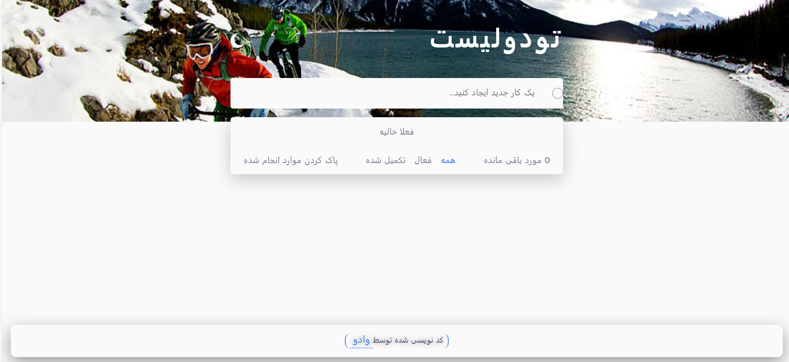

# Todo app

<!-- Screenshot -->

## Key Features

Users should be able to:

- Add new todos to the list
- Mark todos as complete
- Delete todos from the list
- Filter by all/active/complete todos
- Clear all completed todos
- Toggle light and dark mode
- View the optimal layout for the app depending on their device's screen size
- See hover states for all interactive elements on the page

**Bonus Feature:**

- **Data Persistence:** Implemented local storage functionality to ensure that user data is saved, even after a page refresh.

## Continued development

- Drag and drop to reorder items on the list

## Built with

- [React](https://reactjs.org/) - JS library
- CSS
- HTML5
- Mobile-first workflow
- [Vite](https://vitejs.dev/) - A JavaScript module bundler and development server.

## What I Learned

In the process of building my first React project, I gained valuable insights and skills:

- **React Fundamentals:** I grasped the fundamental concepts of React, such as components, state, and props, which formed the backbone of my application.

- **State Management:** I explored state management in React using Redux Toolkit, enabling me to efficiently manage and update the application's data.

- **Modular CSS:** I adopted modular CSS, a new approach that allowed me to create well-structured and maintainable styles for my components, enhancing code organization and reusability.

- **UI/UX Design:** I ventured into UI/UX design principles, striving to create an intuitive and visually appealing interface for the app.

Building this Todo app marked a significant step in my React journey, and I'm excited to continue learning and applying my newfound knowledge to future endeavors.

## Installation

- Install dependencies:

npm install

- Build command:

npm run build

- Live server:

npm run dev

